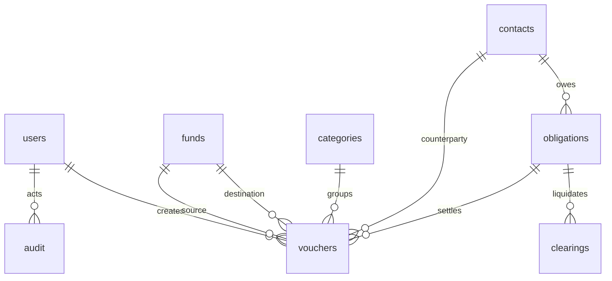

# Database và luồng nghiệp vụ V1

## Mô hình triển khai

Electron + React → IPC bridge → Spring Boot chỉ lắng nghe 127.0.0.1 → SQLite cục bộ. Desktop tạo cổng và khóa kết nối ngẫu nhiên mỗi phiên. Mật khẩu và mã khôi phục dùng BCrypt; token đăng nhập có hạn 8 giờ, chỉ trong bộ nhớ. Renderer không được truy cập Node hoặc filesystem.

App có database độc lập với QLK, không dùng chung số dư hoặc tài khoản. Kế toán là Admin và ghi thu/chi trực tiếp, không có bước tự duyệt. Vai trò VIEWER xem báo cáo và lịch sử, không ghi/xóa dữ liệu hoặc quản lý người dùng. Admin đăng ký các tài khoản tiếp theo. Tài khoản được khóa thay vì xóa để giữ lịch sử.

## Các bảng

| Bảng | Nội dung | Quan hệ / quy tắc |
|---|---|---|
| users | Đăng nhập, mật khẩu băm, mã khôi phục băm, vai trò, trạng thái | Luôn giữ ít nhất 1 Admin hoạt động |
| funds | Nguồn tiền, loại, số dư đầu kỳ, ngày mở, ghi chú | Không xóa khi đã có chứng từ tham chiếu |
| categories | Nhóm thu/chi hoặc cả hai | Không đổi nhóm trái chiều chứng từ đã dùng |
| contacts | Khách hàng, nhà cung cấp, nhân viên, đối tác khác | Chứng từ và công nợ liên kết bằng ID |
| obligations | Công nợ phải trả (bốn nhóm), khoản phải thu cũ chỉ giữ lịch sử, đề nghị tạm ứng, hạn, số tiền gốc | Không suy ra nợ từ Excel hoặc diễn giải phiếu |
| vouchers | Phiếu thu, chi, chuyển quỹ, phí, liên kết nợ/đối tác, nguồn Excel | Phiếu lưu là đã ghi sổ; hủy bằng deleted=1 |
| clearings | Quyết toán chi phí từ tạm ứng đã cấp | Không tác động quỹ; không sửa/xóa chứng từ quyết toán V1 |
| audit | Người thao tác, thời điểm UTC, hành động, trước/sau, lý do | Không có API xóa/sửa, trigger SQLite chặn update/delete |

Schema thực thi: `backend/src/main/resources/schema.sql`. PRAGMA user_version=3; schema.sql tạo schema cơ sở 1 và migration-v2.sql nâng cấp lần lượt lên 2 rồi 3 trong transaction. Từ chối database mới hơn app. Phiên bản sau phải có migration và sao lưu trước migration. Không khởi tạo lại database để cập nhật.

## Chấm công và thông tin ngân hàng (schema 2)

funds thêm bank_name, account_number, account_holder; số tài khoản lưu TEXT. contacts thêm attendance_code; mã nhân viên không rỗng có unique index không phân biệt hoa/thường.

attendance: một bản ghi mỗi employee_id/date, trạng thái WORK/HALF/PAID_LEAVE/UNPAID_LEAVE/OFF, overtime_minutes (bước 15 phút, tối đa 960 phút), note, source=MANUAL, device_record_key để chuẩn bị nhập máy, người tạo/sửa, version và deleted. Chỉ nhân viên được chấm. attendance_months lưu khóa, version, người chốt và thời điểm. Admin ghi công, VIEWER xem. Sửa/xóa/chấm lại, khóa/mở khóa đều giữ audit và kiểm tra version. Không tác động quỹ hoặc tự tính lương.

Nâng cấp schema 1 → 2 có VACUUM backup trước thay đổi và transaction rollback nếu lỗi. Restore chấp nhận schema 1 hoặc 2; schema 1 được kiểm tra rồi nâng cấp trong file tạm trước thay database hiện tại. Schema 2 phải có đủ các cột/bảng mới; từ chối bản mới hơn app hoặc khai báo schema không khớp.

## Tiền và số dư

VND là số nguyên 64-bit; mỗi số tiền không vượt 1.000 tỷ. Không dùng số thực cho tiền. Số dư đầu kỳ có thể âm để phản ánh nguồn thực tế. Phiếu trước ngày mở nguồn bị chặn; ngày số dư là đầu ngày trước mọi phiếu cùng ngày.

Số dư quỹ = số dư đầu kỳ + phiếu thu − phiếu chi − chuyển ra − phí chuyển + chuyển vào. Phiếu bị hủy không tính. Số dư được truy vấn từ chứng từ còn hiệu lực thay vì cộng/trừ vào trường tồn mỗi lần sửa. Tổng công ty không đổi khi chuyển nội bộ; phí chuyển làm giảm tiền và tính vào chi.

Cho phép số dư quỹ âm và hiển thị đỏ để kế toán đối chiếu. Chênh lệch thu chi là dòng tiền, không phải lợi nhuận kế toán. Báo cáo công nợ hiện tại không phải công nợ tại ngày kết thúc kỳ.

## Công nợ

Tạo khoản nợ gốc từ hóa đơn/chứng từ hoặc số dư đã xác nhận → ghi phiếu thanh toán có đúng đối tác và ID nợ → tính số còn lại. Phải trả dùng phiếu chi; khoản phải thu cũ chỉ giữ liên kết lịch sử. Chặn sai đối tác, sai chiều, thanh toán vượt dư và thanh toán trước ngày nợ. Hủy/sửa phiếu thanh toán sẽ tính lại số dư nợ. Không cho đổi loại/đối tác của khoản đã tạo; tạo khoản mới nếu nhập nhầm loại.

## Tạm ứng và tiền cá nhân chi hộ

Đề nghị tạm ứng → Cấp ứng (phiếu chi liên kết ADVANCE_ISSUE) → Hoàn ứng tiền dư (phiếu thu ADVANCE_RETURN) và/hoặc Quyết toán (clearings). Không ghi phiếu chi lần thứ hai khi quyết toán. Chặn quyết toán/hoàn ứng vượt số đã cấp tại ngày đó. Không cho sửa/hủy cấp ứng làm tiền đã hoàn/quyết toán vượt tiền đã cấp.

Khoản còn lại của tạm ứng là số đề nghị trừ hoàn ứng và quyết toán; cột Đã cấp giúp phân biệt phần chưa cấp. V1 ghi nhận tạm ứng đã cấp là dòng tiền chi ngay. Nếu cần báo cáo chi phí kế toán theo ngày quyết toán sẽ bổ sung báo cáo riêng.

Tiền nhân viên tự ứng chi cho công ty: tạo công nợ phải trả nhân viên/đối tác từ chứng từ được xác nhận → khi công ty hoàn trả thì ghi phiếu chi thanh toán. Không coi toàn bộ sổ Anh Hiếu/Anh Lê là tiền công ty chi ra.

## Sửa, hủy, tính nhất quán

Các nghiệp vụ thay đổi tài chính và nhật ký tương ứng chạy cùng transaction. Backend tuần tự hóa thao tác trên database cục bộ. version tăng sau mỗi sửa/hủy, chặn ghi đè từ form cũ. Phiếu sửa/hủy yêu cầu lý do. Phiếu đã hủy vẫn tra được ở lọc Đã hủy và audit có bản gốc/sau thay đổi.

Nhật ký bất biến trong API/SQLite không chống được người có toàn quyền hệ điều hành thay cả file database. Khôi phục quay về toàn bộ dữ liệu và lịch sử của bản sao được chọn; bản trước khôi phục luôn được giữ riêng để tra cứu.

## Sao lưu và khôi phục

VACUUM INTO tạo snapshot nhất quán của toàn database (tài khoản, danh mục, phiếu, nợ, lịch sử). Sao lưu tự động sau khi SQLite mở và phục hồi phiên trước, sao lưu thủ công, sao lưu trước khôi phục/cập nhật. Không copy database đang mở để làm backup.

Khôi phục cần Admin và mật khẩu hiện tại. File tối đa 512MB, integrity_check, foreign_key_check, user_version phù hợp, có bảng và Admin hoạt động, có trigger bảo vệ audit. Kiểm tra trước khi thay file. Tạo snapshot an toàn trước thay thế, đóng các connection kiểm tra, thay database, thu hồi toàn bộ session. Sau đó đăng nhập bằng tài khoản trong bản đã khôi phục.

File backup chứa dữ liệu doanh nghiệp và tài khoản đã băm, chưa mã hóa toàn file. Giữ tại nơi riêng hoặc thiết bị được bảo vệ. V1 không đồng bộ dữ liệu giữa nhiều máy.

## Nhập Excel

Admin chọn file .xlsx tại máy. Apache POI đọc bảng chính của các sheet công ty có cột ngày, diễn giải, thu, chi, tồn. Sử dụng giá trị công thức đã được Excel lưu, không tự tính lại công thức. Dòng thiếu ngày cần xác nhận; dòng có hai chiều/thiếu số tiền bị chặn. Bảng phụ không có số dư và sheet cá nhân không được tự nhập.

Khóa nguồn gồm tên sheet, hàng và cột để chống nhập trùng kể cả sau hủy phiếu. Không đổi tên sheet hoặc di chuyển dòng khi nhập lại cùng sổ. Dữ liệu đối soát lưu riêng trong thư mục dữ liệu máy, không nằm trong mã nguồn hoặc bộ cài. Sau chuyển máy/khôi phục, chọn lại Excel nếu muốn tiếp tục đối soát; phiếu đã nhập và lịch sử có trong backup SQLite.

## Cập nhật

GitHub Releases DoanHuy002/ThuChiVK qua electron-updater + NSIS. App tự kiểm tra khi mở và mỗi 4 giờ. Admin tải → sao lưu → đóng backend → cài → mở lại. Không hạ phiên bản hoặc cài bản thử nghiệm. Kiểm tra checksum file tải; lỗi mạng hoặc sao lưu không gây cập nhật. Database và backup nằm ngoài thư mục cài.

## Schema 3 và nghiệp vụ cập nhật

`migration-v3.sql` thêm contacts.customer_type (DEALER/RETAIL), party_type (SUPPLIER/CARRIER/LENDER/INVESTOR/OTHER), address; obligations.debt_group (SUPPLIER/CARRIER/LOAN/OTHER); vouchers.receipt_group (DEALER/RETAIL/CAPITAL/BORROWING/OTHER khi thu). Bản ghi phải trả cũ mặc định nhóm nhà cung cấp, thu cũ mặc định thu khác để tránh tự suy đoán nội dung. Không xóa khoản phải thu cũ; API danh sách/report loại RECEIVABLE và chặn tạo liên kết mới. Sửa phiếu cũ được giữ liên kết lịch sử.

evidence liên kết entity (vouchers/obligations) và entity_id; lưu tên, MIME, bytes, SHA256, BLOB gốc, caption, deleted, version, created_by/at. Parent được xác nhận trước thao tác; bridge chỉ nhận file do native dialog chọn, nonce sở hữu theo phiên, hết hạn 15 phút. Chặn SVG/loại lạ, kiểm tra đầu file và kích thước ảnh, tên file chỉ là basename; renderer không nhận đường dẫn nguồn. Không cung cấp API ghi trực tiếp đường dẫn. Audit chỉ lưu metadata, không nhân đôi BLOB. Trigger chặn xóa vật lý và sửa nội dung gốc. Gỡ/sửa caption dùng version và lý do. VIEWER đọc cả bản gỡ, ADMIN sửa trên parent còn hiệu lực. VACUUM backup bao gồm BLOB, restore kiểm tra bảng/cột, liên kết, độ dài và trigger trước thay file. Restore nhận schema 1/2/3; file cũ nâng cấp trong bản tạm.

Khoản PAYABLE nhóm LOAN có principal=amount đã xác nhận; LOAN_RECEIVE là receipt/BORROWING, giới hạn nhận không vượt amount. LOAN_PRINCIPAL là expense giảm outstanding; LOAN_INTEREST là expense không giảm outstanding. Giới hạn thanh toán gốc loại self khi sửa, kiểm tra tổng nhận khi sửa; nhóm LOAN không đổi khi có phiếu kể cả đã hủy. Khoản nợ xác nhận tồn tại riêng với dòng tiền, nên nhận vay không tự tạo thêm khoản nợ. Trả lãi sau tất toán gốc được phép. Nhật ký giữ trước/sau và lý do; hủy phiếu tính lại nợ và nguồn tiền.

Dashboard dùng voucher còn hiệu lực trong kỳ cho biểu đồ, report cho tổng tiền và công nợ hiện tại. Chi gồm expense và transfer.fee, không transfer.amount. Phân loại chi có gốc/lãi riêng; thu capital/borrowing tách khỏi sales. Đồ thị cột zero có height=0, pie không dùng số dư âm hoặc dữ liệu giả. Các bộ lọc drilldown dùng receipt_group, purpose, category, fund và nhóm/trạng thái nợ. Nhập ngày và lịch ở renderer Việt hóa, API/SQLite lưu ISO; nhật ký đổi UTC sang Asia/Ho_Chi_Minh khi hiển thị.
